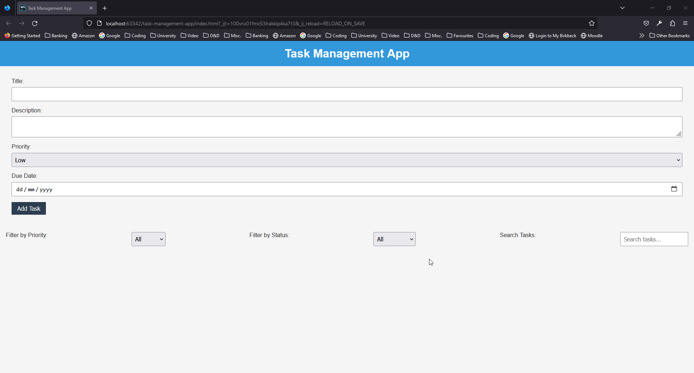

# Task Management App

A simple and modern Task Management App built with HTML, CSS, and JavaScript. The app allows users to add, complete, 
delete, search, and filter tasks. It also saves tasks to the browser's local storage to persist them across sessions.

## Features

- Add new tasks with title, description, priority, and due date
- Mark tasks as complete or incomplete
- Delete tasks
- Filter tasks by priority and status (completed or incomplete)
- Search tasks by title or description
- Save tasks to local storage

## Demo




## Installation

1. Clone the repository:

```bash
git clone https://github.com/yourusername/task-management-app.git
```

2. Change to the project directory:
    
```bash
cd task-management-app
```

3. Open the `index.html` file in your preferred web browser.

## Usage

1. Fill in the form fields to create a new task and click "Add Task."
2. Click "Complete" to toggle the completion status of a task.
3. Click "Delete" to remove a task from the list.
4. Use the priority and status filters to show tasks that match specific criteria.
5. Use the search bar to search for tasks containing specific keywords in their title or description.

## Contributing

Pull requests are welcome. For major changes, please open an issue first to discuss what you would like to change.

